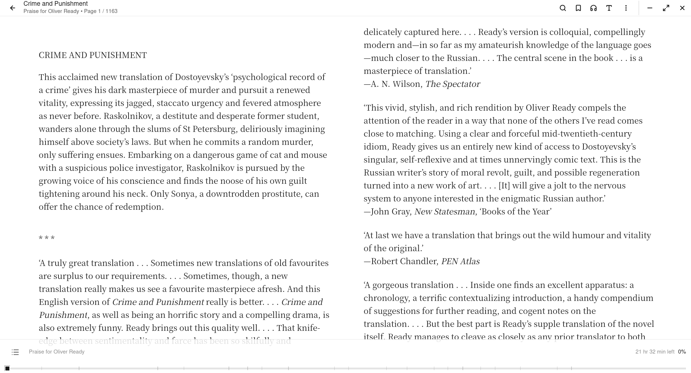
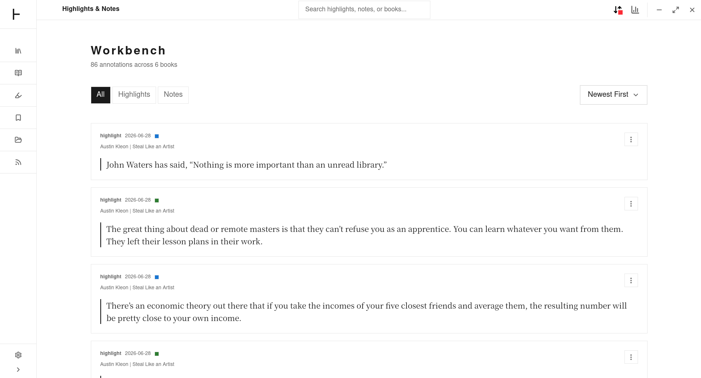
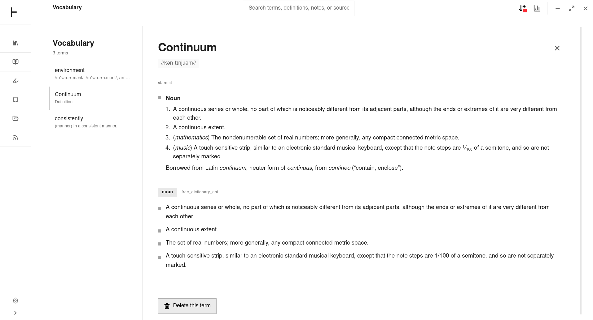
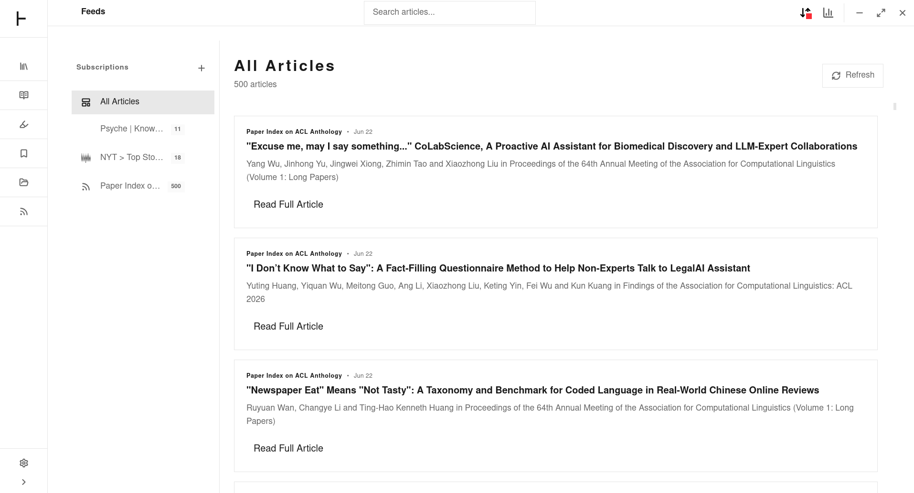
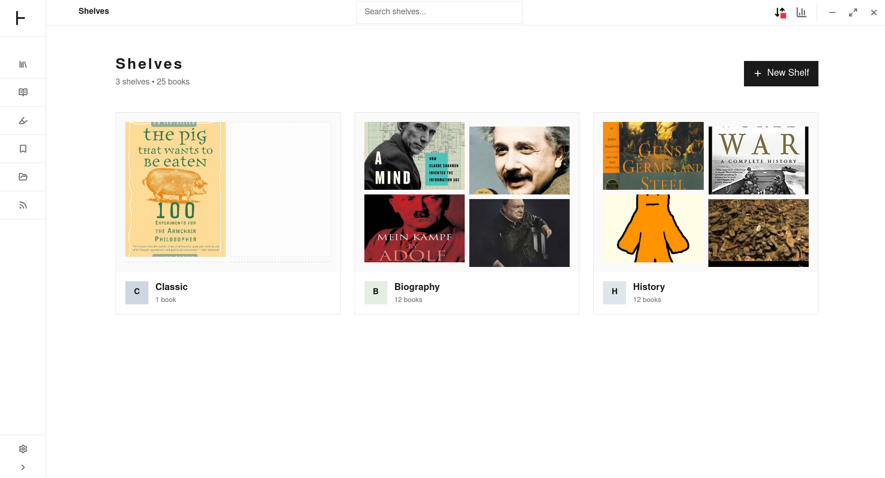
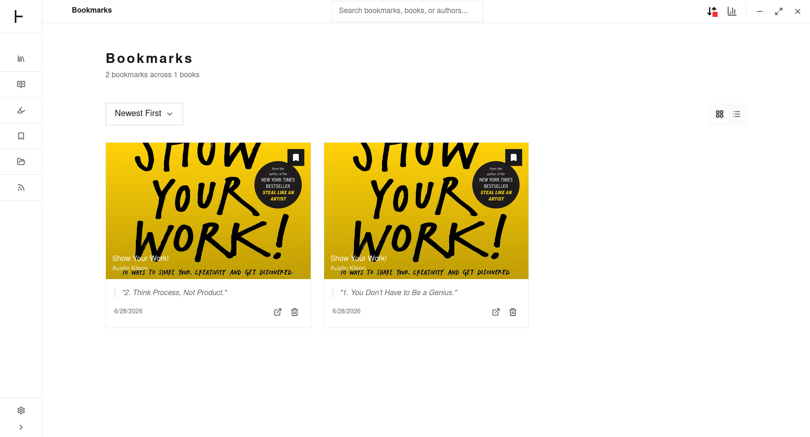
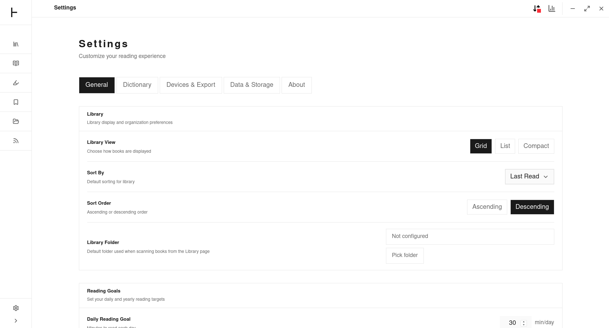

# Theorem

**Own your reading data. Forever.**

[](https://app.theorem.fundaments.work)
[](https://github.com/fundaments-work/theorem/releases/latest)
[](./LICENSE)
[](https://github.com/fundaments-work/theorem/releases/latest)
[](https://github.com/fundaments-work/theorem/actions)
[](https://github.com/fundaments-work/theorem/pulls)

**[theorem.fundaments.work](https://theorem.fundaments.work)** — website, docs, and release downloads.

**[app.theorem.fundaments.work](https://app.theorem.fundaments.work)** — try the fully functional web demo in your browser.

Theorem is a **free, open-source, local-first** reading app built with [Tauri](https://tauri.app). It runs on **Linux, macOS, Windows, and Android** from a shared codebase.

Read PDFs, EPUBs, MOBI, FB2, CBZ, CBR, and RSS feeds — all in one workspace. Highlight and annotate with six colors. Look up words with offline dictionaries. Listen with neural text-to-speech. Share highlights as beautiful images. Sync everything to Markdown files in your Obsidian or Logseq vault.

**No cloud account. No subscription wall. No vendor lock-in.**

---

<p align="center">
  
  <br>
  <em>Theorem reader — PDF with highlights, freehand drawing, and dark theme</em>
</p>

## Features

### Multi-Format Reader
- EPUB, MOBI, AZW, AZW3, FB2, CBZ, CBR, PDF, TXT, and RSS articles
- Foliate-based reflowable rendering with paged and scroll modes
- PDF.js engine with zoom (50–200%), page-fit/width-fit modes, and outline navigation
- Full table of contents navigation with section progress
- Estimated reading time per page and chapter
- Reading progress saved per-book across sessions (page-accurate + CFI)
- File association — open ebooks directly from your file manager
- Open With support via Tauri OS integration

### Reading Customization
- Three reader themes: **Light**, **Sepia**, **Dark**
- Font family: original, serif, sans-serif, monospace
- Font size (12–36), line height (1.0–2.5), margins (0–35%)
- Letter spacing, word spacing, paragraph spacing controls
- Text alignment: left, justify, center
- Hyphenation toggle
- Page animation styles: slide, fade, instant
- Page layout: single, double, auto
- Reading flow: paged, scroll, auto
- Brightness slider (0–100%)
- Zoom for fixed-layout formats (50–200%)
- Full-screen reading mode
- Auto-hide toolbar with configurable delay
- Force publisher styles override
- Performance: prefetch distance (1–3 sections), animations toggle, virtual scrolling
- Per-word highlighting during TTS immersion reading

### Highlights & Annotations
- Six color-coded highlight colors: yellow, green, blue, red, orange, purple
- Add notes to any highlight
- Bookmarks (separate annotation type)
- Overlayer drawing styles: highlight, underline, strikethrough, squiggly, outline
- Annotation panel with quick navigation, editing, and deletion
- Deletion tombstones for sync integrity (90-day retention)
- Works across all formats including PDF and RSS articles

<p align="center">
  
  <br>
  <em>Annotation panel with color-coded highlights and notes</em>
</p>

### PDF Annotations
- Highlight with rectangular selection (supports multi-line rects)
- Freehand drawing with configurable stroke width
- Text notes placed anywhere on the page
- Per-page annotation rendering
- Zoom modes: custom, page-fit, width-fit
- PDF view state persistence (page, zoom, mode per-session)

### Highlight Sharing
- Generate polished share-card images from any highlight
- Share reading statistics as beautiful cards
- Multiple formats: Square (1080×1080) and Story (1080×1920)
- Multiple visual themes: match, dark, tinted, sepia
- Download as PNG to disk
- Copy image to clipboard
- Native share via Web Share API
- Share directly to X (Twitter)
- Android: saves to MediaStore gallery

### Neural Text-to-Speech (Immersion Reading)
- Kokoro ONNX neural TTS engine — fully offline, no cloud API
- 6 distinct voices: Bella (US F), Nicole (US F), Sarah (US F), Adam (US M), Michael (US M), George (UK M)
- Gapless streaming audio with Web Audio API scheduling
- Per-word highlighting synchronized with audio
- Preloads next page audio for seamless page turns
- Voice switching during playback
- **Note**: On Android and mobile devices, TTS synthesis is significantly slower than desktop (5–10s per sentence) due to CPU-only ONNX inference. Desktop (macOS, Windows, Linux) has near-real-time performance after model warmup.
- Model management: download status, cancel/delete model
- Auto-downloads model on first use (with progress tracking)
- Test voice before playing

### Vocabulary Builder
- Look up words while reading with built-in dictionary
- Offline StarDict dictionary support (import local `.ifo`/`.idx`/`.dict.dz` files)
- Browse and download dictionaries from remote repository (English Wiktionary ~50MB)
- Dictionary download progress tracking with cancel support
- Pronunciation display with optional audio
- Vocabulary capture and review workspace
- Word lookup cache (LRU, 100 entries)

<p align="center">
  
  <br>
  <em>Vocabulary workspace — save words, view definitions, track your learning</em>
</p>

### RSS Reader
- Subscribe to feeds with full annotation tools
- Article extraction via Mozilla Readability
- Feed discovery from web pages
- Offline article storage with caching
- Feed metadata: site URL, description, icon, error tracking
- Per-feed unread count
- Article favoriting
- Noise filtering (strips ads, share buttons from extracted content)
- Reader view with font/theme customization

<p align="center">
  
  <br>
  <em>RSS reader — subscribe, read, and annotate articles alongside your books</em>
</p>

### Markdown Export (Obsidian / Logseq)
- Export highlights and annotations to local Markdown files
- Designed for vault-based PKM workflows (Obsidian, Logseq, Zettelkasten)
- Per-book markdown pages with YAML frontmatter
- Vocabulary markdown export with definitions, phonetics, providers
- RSS article annotations included in vault export
- Customizable file naming (highlights base name, vocabulary file name)
- One-click "Export now" button in settings
- Export status indicator (sync/error/idle with timestamps)
- Legacy index file cleanup

### Library Management
- Book import from local files or by dragging and dropping
- Folder scanning for batch import (recursive, with Rust-powered walk)
- Custom collections / shelves — create, rename, delete
- Add/remove books from collections
- Favorites toggle with dedicated section
- Book ratings (1–5 stars)
- Tags and categories
- Multiple view modes: grid, list, compact
- Sort by title, author, date added, last read, progress, rating (ascending/descending)
- Library search by title, author, or tags
- Magic byte format detection (PDF, MOBI, FB2, RAR, EPUB/CBZ)
- SHA-256 content hash deduplication
- Concurrency-controlled batch import (adaptive 1–8 workers)
- Filename metadata extraction ("Author - Title" patterns)
- Android content:// URI support
- FBZ / fb2.zip compressed format support

<p align="center">
  
  <br>
  <em>Library with custom shelves, favorites, and grid view</em>
</p>

### Reading Statistics
- Reading time tracking (total and per-book, in minutes)
- Pages completed and books finished
- Reading streaks: current streak + longest streak
- Reading speed: average words-per-minute
- Daily activity log with 12-week heatmap grid
- Reading goals: daily goal (minutes) and yearly book goal
- Achievement badges: First Book, Bookworm (5 books), On Fire (7-day streak), Highlighter (10 highlights)
- Book completion tracking (auto at 100% or manual read/unread override)
- Progress snapshot before finish for undo

<p align="center">
  
  <br>
  <em>Track reading progress, bookmarks, and completions</em>
</p>

### LAN Device Sync
- Encrypted peer-to-peer sync between Theorem installs on local network
- Syncs books, reading progress, annotations, collections, and settings
- QR-based device pairing (scan to pair, generate to share)
- Device identity management with public-key encryption
- Auto-sync on peer discovery
- Periodic background auto-sync toggle
- Paired device management with last sync timestamps
- Deletion tombstone propagation for sync integrity
- No cloud relay — fully local and private

### Backup & Data Management
- Full backup bundle export: books (with binary data), annotations, collections, settings, statistics, vocabulary, dictionaries, RSS feeds
- Clear all application data with confirmation dialog
- Storage usage breakdown: Books, Highlights & Notes, RSS Articles, Offline Dictionaries
- Cache size configuration

<p align="center">
  
  <br>
  <em>Settings with storage breakdown, backup export, and data management</em>
</p>

### Cross-Platform
- Desktop: Linux (`.deb`, `.AppImage`), macOS Intel + Apple Silicon (`.dmg`), Windows (`.msi`, `.exe`)
- Mobile: Android (`.apk`) with content URI and SAF folder picker support
- Web: Browser fallback for development and preview
- All from a single TypeScript + Rust codebase
- Shared rendering engines and state management across platforms

### First-Run Experience
- Step-by-step onboarding flow covering library, reader, annotations, and sync
- Persisted completion state — auto-dismisses on subsequent launches

---

## Tech Stack

| Layer | Technology |
|-------|------------|
| Frontend | React 19, TypeScript, Vite 8 |
| State | Zustand 5 (persisted + versioned migrations) |
| Styling | Tailwind CSS v4, CSS design tokens |
| Desktop | Tauri 2 (Rust) |
| Mobile | Tauri 2 Android |
| PDF | PDF.js 6 |
| Ebook | Foliate.js (vendored) |
| TTS | Kokoro ONNX via `kokoro-en` (Rust, pure misaki-lean phonemizer) |
| Dictionary | StarDict |
| RSS | Mozilla Readability |
| Archive | zip.js, unrar-ng (Rust, bundled C source) |
| Testing | Vitest + jsdom |

---

## Why Theorem?

Theorem is built for **knowledge workers** who want to own their reading data:

- **Your data stays local** — everything is stored on your device. No cloud, no tracking, no data mining.
- **Portable by design** — exports are plain Markdown files. Move to any tool anytime.
- **True offline-first** — works completely without internet. Sync when you choose.
- **No subscriptions** — free and open-source. Always.

### Is Theorem a Readwise alternative?

Yes. Local-first reading, annotation, and Markdown export without a paid subscription. Plus: ebook reader, RSS reader, vocabulary builder, neural TTS, LAN sync, and highlight sharing — all in one app.

---

## Download

| Platform | Download |
|----------|----------|
| Linux | `.deb` or `.AppImage` |
| macOS (Intel) | `.dmg` |
| macOS (Apple Silicon) | `.dmg` |
| Windows | `.msi` or `.exe` |
| Android | `.apk` |

All builds are available on the [Releases page](https://github.com/fundaments-work/theorem/releases/latest). See [theorem.fundaments.work](https://theorem.fundaments.work) for documentation and downloads.

---

## Quick Start (Development)

### Prerequisites

- **Node.js 22+** and **pnpm 10+**
- **Rust** (stable, via [rustup](https://rustup.rs))
- **System libraries**: see [Tauri prerequisites](https://tauri.app/start/prerequisites/)

### Setup

```bash
git clone https://github.com/fundaments-work/theorem.git
cd theorem
pnpm install
```

### Run

```bash
pnpm dev          # Web dev server (http://localhost:1420)
pnpm dev:tauri    # Desktop app in dev mode
```

### Commands

| Command | Description |
|---------|-------------|
| `pnpm dev` | Start Vite dev server |
| `pnpm dev:tauri` | Start Tauri desktop app |
| `pnpm build` | Typecheck + production build |
| `pnpm typecheck` | TypeScript type checking |
| `pnpm test` | Run Vitest unit tests |
| `pnpm test:coverage` | Tests with coverage report |
| `pnpm package:linux` | Build Linux release package |

### Architecture

The frontend is built with **React 19**, **TypeScript**, **Zustand** for state, and **Tailwind CSS v4** for styling. The desktop backend is **Tauri 2** with Rust commands for file I/O, TTS, sync, and platform integration.

Rendering engines:
- **Foliate.js** (vendored) — reflowable ebook formats and comic books
- **PDF.js** — PDF rendering and annotation
- **Mozilla Readability** — RSS article extraction

See [AGENTS.md](./AGENTS.md) for the full repository map and development conventions.

---

## Contributing

Contributions are welcome! See [CONTRIBUTING.md](./CONTRIBUTING.md) for guidelines.

1. Fork the repository
2. Create a feature branch (`git checkout -b feature/amazing-feature`)
3. Follow [conventional commits](https://www.conventionalcommits.org/)
4. Open a Pull Request

---

## FAQ

**Is my data safe?** — Yes. Everything is stored locally. No cloud account required.

**Can I migrate away?** — Yes. Exports are plain Markdown files, portable to any tool.

**Does it work with Obsidian and Logseq?** — Yes. Markdown sync is designed for vault-based workflows.

**Is there device sync?** — Yes. Encrypted LAN pairing between Theorem installs, no cloud relay.

**Does TTS work offline?** — Yes. The Kokoro ONNX model runs entirely on-device. First use downloads the model (~170MB) from HuggingFace.

**What formats are supported?** — EPUB, MOBI, AZW, AZW3, FB2, FBZ, CBZ, CBR, PDF, TXT, and RSS feeds.

**Is CBR supported?** — Yes. CBR (RAR comic archives) are transparently converted to CBZ at import time.

**Can I try it without installing?** — Yes. The [web demo](https://app.theorem.fundaments.work) runs in your browser. Everything works except LAN sync and TTS (which need the native Tauri backend).

**Why MIT instead of AGPL?** — MIT lets anyone use, modify, and integrate the code without forcing them to open-source their changes. This encourages adoption by individuals, educators, and organizations who want to customize Theorem for their own needs. AGPL (used by Readest) is stronger copyleft — modifications must be shared, which can discourage contributions from corporate users. For a local-first reading app that stores all data as plain Markdown, the protection AGPL offers is unnecessary: your data is already portable and not locked to any vendor.

---

## License

MIT License — see [LICENSE](./LICENSE) for details.
